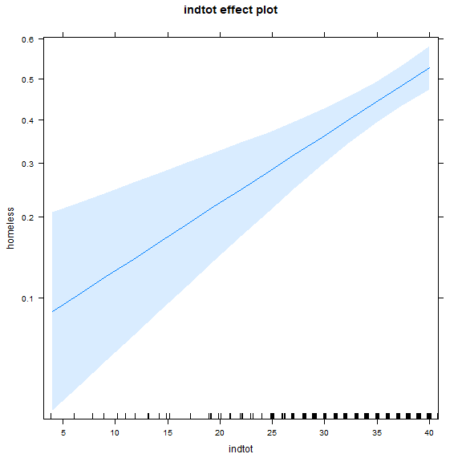

<!-- R Commander Markdown Template -->

Replace with Main Title
=======================

### Your Name

### 2018-03-27


```r
> GLM.1 <- glm(homeless ~ indtot, family=binomial(logit), data=h1)
> summary(GLM.1)
```

```

Call:
glm(formula = homeless ~ indtot, family = binomial(logit), data = h1)

Deviance Residuals: 
   Min      1Q  Median      3Q     Max  
-1.376  -1.140  -0.733   1.128   2.060  

Coefficients:
            Estimate Std. Error z value   Pr(>|z|)    
(Intercept) -2.60668    0.56947  -4.577 0.00000471 ***
indtot       0.06808    0.01542   4.414 0.00001013 ***
---
Signif. codes:  0 '***' 0.001 '**' 0.01 '*' 0.05 '.' 0.1 ' ' 1

(Dispersion parameter for binomial family taken to be 1)

    Null deviance: 625.28  on 452  degrees of freedom
Residual deviance: 602.87  on 451  degrees of freedom
AIC: 606.87

Number of Fisher Scoring iterations: 4
```

```r
> exp(coef(GLM.1))  # Exponentiated coefficients ("odds ratios")
```

```
(Intercept)      indtot 
 0.07377943  1.07044632 
```


```r
> plot(allEffects(GLM.1))
```




```r
> library(MASS, pos=29)
```


```r
> Confint(GLM.1, level=0.95, type="LR")
```

```
Waiting for profiling to be done...
```

```
               Estimate      2.5 %      97.5 % exp(Estimate)      2.5 %
(Intercept) -2.60667535 -3.7673400 -1.53014954    0.07377943 0.02311346
indtot       0.06807568  0.0388173  0.09938881    1.07044632 1.03958053
               97.5 %
(Intercept) 0.2165033
indtot      1.1044957
```


