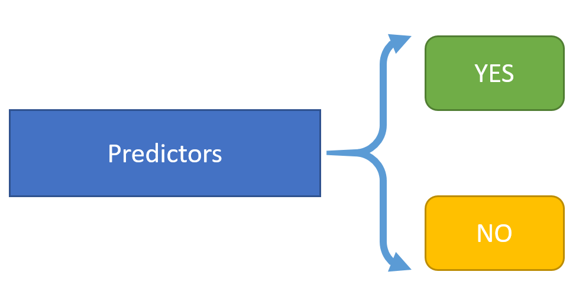

```{r setup, include=FALSE}
knitr::opts_chunk$set(echo = TRUE)
```

## Understanding the LOGIT function

In logistic regression to goal is to predict the probability of an outcome like YES vs NO or the probability that the regression equation predicts membership in group A or B.



The linear logistic-regression or the linear logit model is given by this equation

$$ \pi_i = \frac{1}{1+exp[-(\alpha + \beta X_i)]} $$

where $\pi_i$ is the probability of the desired outcome.

Given this equation then

$$ Odds = \frac{\pi}{1 - \pi} $$

and

$$ Logit = log_e(\frac{\pi}{1 - \pi}) $$

and

$$ Logit = \alpha + \beta X_i $$

So, let's look at a hypothetical logistic regression equation where 

$$ Logit = 2 + 1.5 X_i $$

We'll look at this function over X's ranging from -5 to 2 and we'll look at each step in between by computing the Logit, Odds and Probability and then we'll make a plot of each one.

```{r}
x <- seq(from=-5, to=2, by=0.1)
y.logit <- 2 + 1.5*x
y.odds <- exp(y.logit)
y.prob <- y.odds/(1+y.odds)
x.df <- data.frame(x,y.logit,y.odds,y.prob)
```

### Table of X, Logit, Odds, Probability (excerpt of 20 rows)

```{r}
knitr::kable(x.df[30:50,],
             col.names = c("X",
                           "Logit = 2+1.5x",
                           "Odds = P/1-P",
                           "Probability P"))
```

### Plot of the Logit

```{r}
plot(x,y.logit,
     xlab = "X values",
     ylab = "Logit = 2 + 1.5*X")
lines(x,y.logit)
```

### Plot of the Odds

```{r}
plot(x,y.odds,
     xlab = "X values",
     ylab = "Odds = exp(2 + 1.5*X)")
lines(x,y.odds)
```

### Plot of the Probability

```{r}
plot(x,y.prob,
     xlab = "X values",
     ylab = "Probability = Odds/(1+Odds)")
lines(x,y.prob)
```

So, when we "fit" a logistic regression model, we are solving for the best fit line for this equation:

$$ Logit = log_e(\frac{\pi}{1 - \pi}) = \alpha + \beta X_i $$

where the "logit" function LINKS the outcome (or a mathematical transformation of the outcome) - in this case the $\pi$ with the linear predictor equation $\alpha + \beta X_i$.

Similarly, if we take the "exponent" of both sides of this equation we get:

$$ Odds = \frac{\pi}{1 - \pi} = e^{\alpha + \beta X_i} $$

This is why logistic regression yields "ODDS RATIOS" or some software lists these as "exp B".

## More on Generalized Linear Models

The LOGIT (logistic regression) is your first introduction to the "Generalized" Linear Model. There are several LINK functions that are useful to know for other kinds of outcomes:


Family          | Link           | Function         | Type of Outcome
----------------|----------------|------------------| -------------------
Gaussian        | Identity       | $\mu_i$          | Continuous - Normal
Binomial        | Logit          | $log_e(\frac{\pi}{1 - \pi})$ | Dichotomous; 2 categories
Poisson         | Log            | $log_e(\mu_i)$   | Count
Gamma           | Inverse        | $\mu_i^-1$       | Time to event - Survival
Inverse-Gamma   | Inverse-square | $\mu_i^-2$       | Inverse of the Gamma

## Poisson Regression

For the Poisson distribution for a count variable, the probability of any given count occuring is given by this equation, where 

* k=0,1,2,... the count of interest
* $\lambda$ is the rate of occurence (the mean number of events in a fixed time interval)
* and k! factorial is `k*(k-1)*(k-2)*...*3*2*1`

$$ P(Y=k) = \frac{\lambda^k e^{- \lambda}}{k!} $$

So, when we fit a Poisson regression equation, we are solving this equation

$$ log(Y) = \alpha + \beta_1 X_i $$

So, the actual count Y is equal to

$$ Y = e^{\alpha + \beta_1 X_i} $$
